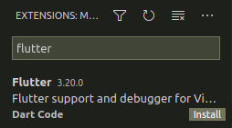
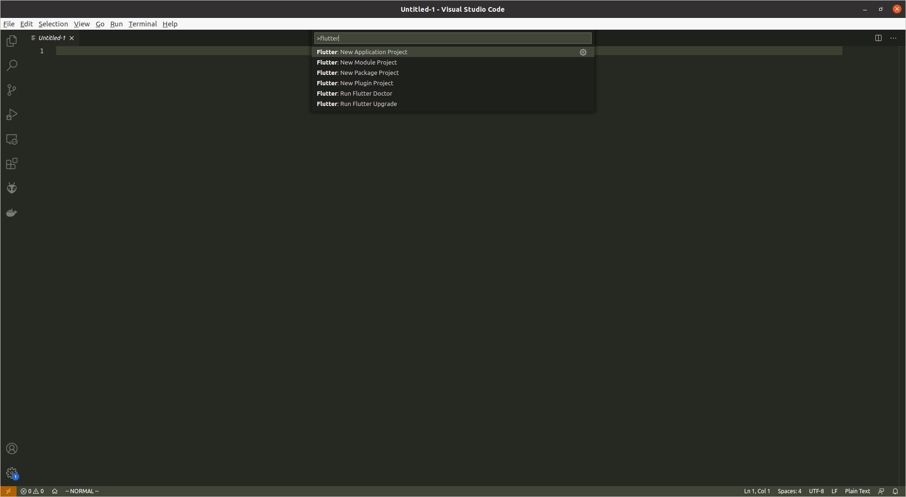
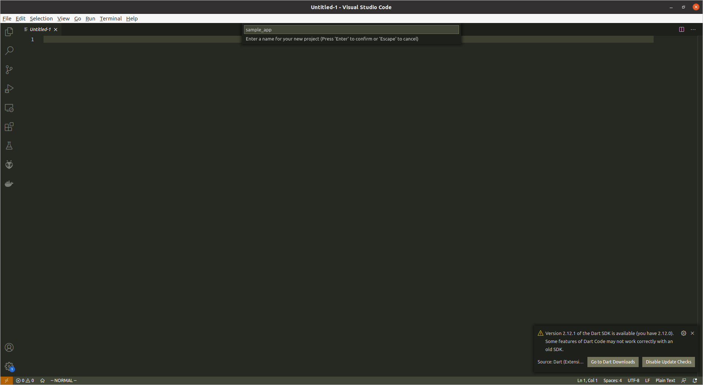
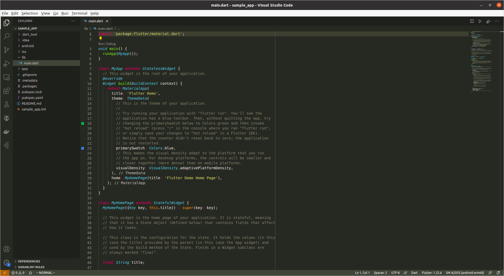
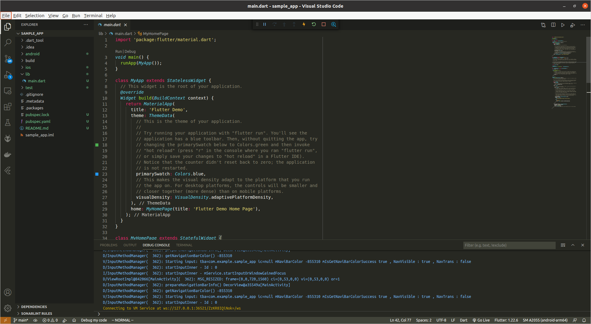
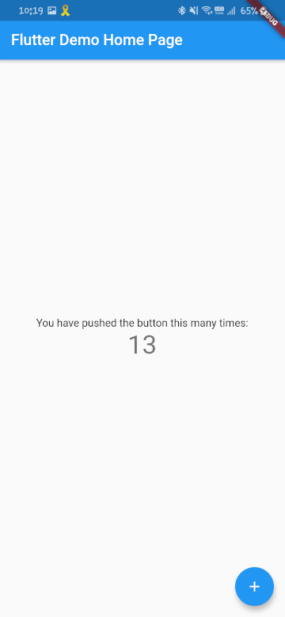

1주차: 플러터 소개 및 환경 구축
===

플러터란 무엇인가
---

흔히 앱 개발을 한다고 하면 안드로이드 앱과 아이폰 앱을 생각할 수 있습니다.    
안드로이드 앱은 Java 또는 Kotlin을 사용하여 구현하며 아이폰 앱은 Swift를 사용하여 구현하죠.    
이와 같이 각 모바일 운영체제에 맞는 언어로 개발하여 해당 운영체제에 특화된 앱을 **네이티브 앱 _native app_** 이라고 합니다.    

네이티브 앱은 모바일 운영체제마다 개별적으로 구현해야 하기 때문에 개발하는 데 오래 걸리며, 하나의 수정사항에 대해 각각의 앱을 개별적으로 수정해주어야 한다는 단점이 있습니다.    
동일한 내용을 안드로이드 용으로 한 번, 아이폰 용으로 한 번 구현해야 하는 것이죠.    
이런 단점을 보완하기 위해 앱의 화면을 모바일 웹을 활용하여 만든 **웹 앱 _web app_** 이나 웹 앱에 별도의 프레임워크를 이용해 각 모바일 운영체제별로 동작하는 앱을 만드는 방식의 **하이브리드 앱 _hybride app_** 과 같은 대안책이 나오기 시작했습니다.    
이러한 시도 속에서 나온 크로스 플랫폼 앱 개발 프레임워크 중 **플러터 _flutter_** 라는 녀석에 대해 알아보고자 합니다.

플러터는 프레임워크, 엔진, 임베더 계층의 세 개의 계층으로 이루어져 있습니다.    

- **프레임워크 계층 _framework layer_**    
Dart 언어로 개발된 여러 클래스를 이용해 앱을 개발하는 계층    
- **엔진 계층 _engine layer_**    
C/C++ 언어로 개발되었으며 플러터의 코어를 담당하는 계층    
데이터 통신, Dart 컴파일, 렌더링, 시스템 이벤트 등 처리    
- **임베더 계층 _embedder layer_**    
플러터 앱이 크로스 플랫폼에서 동작하도록 플러터 엔진이 렌더링한 결과를 플랫폼별 네이티브 언어로 뷰를 만들어 화면에 보여주는 계층

플러터로 구현한 앱은 네이티브 앱에 비해 조금 무겁지만 다른 크로스 플랫폼 앱 개발 프레임워크에 비해 빠르고 네이티브 앱에 근접한 속도를 자랑합니다.

플러터 개발 환경 구축하기
---

플러터를 사용하기 위해서는 플러터 SDK를 내려 받아야 한다.    
[플러터 웹 사이트](https://flutter.dev/docs/get-started/install)에서 운영체제에 맞는 SDK를 내려 받을 수 있습니다.    
운영체제에 따른 방법을 보고 따라 하면 되며, 환경 변수를 설정하는 것도 잊지 말도록 합시다.    
플러터 SDK를 내려 받았으면 `bin` 이라는 이름의 디렉토리가 있을텐데, 이 디렉토리의 경로를 환경변수 `PATH` 에 추가해야 원활한 플러터 사용이 가능합니다.

예를 들어, Debian 계열의 Linux 운영체제를 사용할 경우,    

```bash
$ wget https://storage.googleapis.com/flutter_infra/releases/stable/linux/flutter_linux_2.0.1-stable.tar.xz
$ tar xf ~/Downloads/flutter_linux_2.0.1-stable.tar.xz -C ~
```

를 통해 플러터 SDK를 내려 받아 압축을 풀 수 있으며, 홈 디렉토리의 `.profile` 파일에 다음과 같이 환경 변수를 설정하고

```bash
export PATH="$HOME/flutter/bin:$PATH"
```

터미널을 재실행 하거나 다음 명령어를 입력하여 이를 반영할 수 있습니다.

```bash
$ . .profile
```

플러터 SDK를 내려 받았으면 XCode, Android Studio, 또는 Visual Studio Code 등을 통해 앱 개발을 할 수 있는데, 보다 가벼운 개발 플랫폼을 위해 Visual Studio Code(이하 VSC)를 사용하도록 하겠습니다.    

[VSC 다운로드 페이지](https://code.visualstudio.com/download)에서 자신의 운영체제에 맞게 내려 받아 설치하도록 합니다.    


VSC를 실행 후 좌측 메뉴의 확장 플러그인 설치 메뉴를 누르거나 `ctrl + shift + x` 를 누른 뒤 `flutter` 를 검색하여 이를 설치합니다.



설치가 되었다면 재실행 없이 바로 플러터 명령어를 사용할 수 있습니다.

상단 메뉴바의 `View > Command Palette...` 버튼을 누르거나 `ctrl + shift + p` 를 눌러 커멘드 파레트를 열고, 다음과 같은 명령어를 실행합니다.

```
> Flutter: New Application Project
```



플러터 앱 프로젝트를 생성할 디렉토리를 선택하고 프로젝트 이름을 입력하면 해당 디렉토리 아래에 프로젝트 이름과 같은 이름을 가진 디렉토리가 생성됩니다.

프로젝트 이름을 `sample_app` 으로 설정하여 생성해봅시다.



잠시 기다리면 프로젝트를 위한 기본 파일들이 자동으로 생성된 것을 확인할 수 있습니다.



이렇게 생성된 프로젝트는 우측 상단의 `▷` 버튼(Run Without Debugging)을 통해 실행할 수 있는데, 이 때 앱을 실행하기 위한 기기가 필요합니다.    
~~자신의 핸드폰에 실습 앱을 설치하고 싶지 않다면 스마트폰 환경을 PC에서 가상으로 사용할 수 있는 애뮬레이터를 사용하는 방법도 있긴 하지만, 애뮬레이터를 사용해보면 그 프로그램이 얼마나 무거운지 실감하며 "차라리 내 폰에 설치하고 말지..."를 느끼게 될 겁니다.~~

앱을 실행할 수 있는 기기가 없을 땐 우측 하단에 `No Device` 라고 뜰 텐데, USB 케이블을 통해 자신의 핸드폰을 연결하면 그곳에 기기 이름이 뜰 것입니다.    
경우에 따라서는 개발자 모드를 켜고 `개발자 옵션 > USB 디버깅` 을 켜주어야 할 수도 있습니다.    

실행 버튼을 누르면 다음과 같이 실행되는 것을 확인할 수 있습니다.    



 

이 샘플 앱은 우측 하단의 플로팅 버튼을 클릭할 때마다 화면의 숫자가 1씩 증가합니다.    

애뮬레이터 설치
---

특별한 경우가 아니라면 본인 핸드폰 혹은 공기계를 이용하여 실습하길 권장 드립니다만, Mac 없는 아이폰 유저라던가 특별한 이유가 있다면 애뮬레이터를 사용해야 할 수 있으니 간단하게 언급하고 넘어갑니다.    
애뮬레이터를 사용하지 않을 것이라면 이 절은 생략하고 넘어가셔도 좋습니다.    

먼저 [OpenJDK](https://github.com/ojdkbuild/ojdkbuild)를 내려받아 압축을 풀고 해당 디렉토리를 환경 변수 `PATH` 에 추가합니다.    
그리고 [Android SDK tools 설치 페이지](https://developer.android.com/studio)에서 맨 아래 `Command line tools only` 에서 본인의 운영체제에 맞는 압축 파일을 찾아 내려 받고, 마찬가지로 압축을 풀어 환경 변수 `PATH` 에 추가합니다.    
~~`Command line tools only` 가 아니라 Android Studio째로 설치해도 상관은 없지만... 불필요한 것들까지 함께 설치되어 저장 공간을 많이 차지하게 될테니 필요한 것만 설치하는 게 좋겠죠?~~    
bash, zsh, PowerShell 등의 터미널을 열어 다음의 명령어를 실행합니다.    
애뮬레이터 실행을 위해 필요한 플랫폼 도구와 API 버전, 드라이버를 설치하는 과정입니다.    

```bash
$ sdkmanager "platforms;android-28" "build-tools;28.0.3" "platform-tools" "extras;google;usb_driver"
```

라이선스에 대해 Accept하겠냐는 질문이 나올텐데 `y` 를 입력 후 엔터를 누르면 설치가 시작될 것입니다.

마지막으로 다음 명령어를 통해 안드로이드 라이선스에 동의하면 모든 준비가 끝납니다.

```bash
$ flutter doctor --android-licenses
```

안드로이드 애뮬레이터 실행은 환경에 따라 차이가 있지만, x86에서 안드로이드 SDK 버전 27의 애뮬레이터를 생성할 경우 다음과 같은 명령어를 사용합니다.

```bash
$ sdkmanager "system-images;android-27;google_apis_playstore;x86"
$ flutter emulators --create flutter_emulator
```

그리고 생성된 애뮬레이터를 실행하고자 한다면 다음과 같은 명령어를 사용합니다.    

```bash
$ flutter emulators --launch flutter_emulator
```

정상적으로 실행되었다면 우측 하단의 기기 메뉴에 애뮬레이터 이름이 뜰 것이며 이제 `▷` 버튼을 누르면 애뮬레이터를 통해 앱을 실행할 수 있습니다.

과제
---

자, 이걸로 플러터 앱 개발을 위한 준비를 마쳤습니다.    
오늘의 과제는 아주 간단합니다.    
실습 환경 구축을 마친 후 플러터 앱 프로젝트를 생성한 화면의 스크린샷과 이를 실행한 앱(기기 또는 애뮬레이터)의 스크린샷을 git 저장소에 올려 PR을 보내주시면 됩니다.    
(애뮬레이터의 경우 플러터 앱 프로젝트 화면과 함께 한 장의 스크린샷으로 올려 주셔도 무방합니다.)    

본인 이름 혹은 식별할 수 있는 문자열로 된 디렉토리를 생성하고 그 하위 디렉토리로 `chapter01` 을 만들어 그 안에 이미지 파일을 넣어주세요.    
과제를 성공적으로 완료하였다고 판단되면 merge 해드리며, 그렇지 않을 경우 comment로 피드백 드리겠습니다.    
~~(이번 과제에서는 성공적으로 완료 못하기도 어려울 것 같지만...)~~
