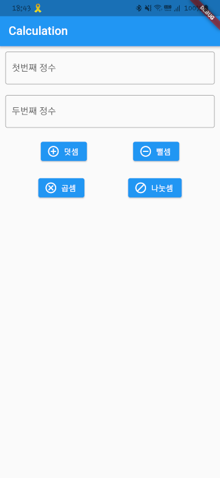
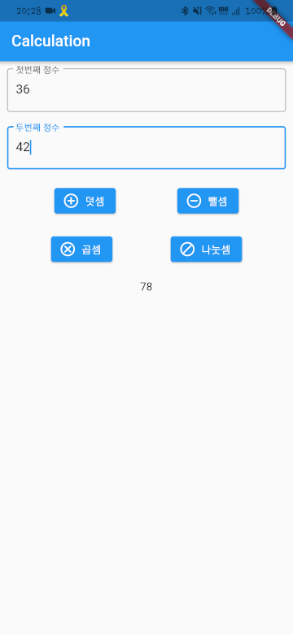

머터리얼과 쿠퍼티노
===

플러터 앱은 위젯으로 이루어져 있다고 했습니다.    
이번 시간에는 위젯에 대해 더 자세히 알아보도록 하겠습니다.

Android과 iOS은 서로 추구하는 디자인이 달라, (물론 공통으로 사용하는 위젯도 있지만) 서로 다른 위젯 클래스를 사용하여 앱을 개발합니다.    
보통 플러터 앱을 개발할 땐 기능적인 코드 베이스만 동일하게 사용하고 디자인적인 부분은 각각의 디자인 철학에 맞는 위젯을 사용하여 구현하죠.    
~~사실 플러터 앱은 Android와 iOS의 기본 위젯을 사용하는 게 아니라 [Skia](https://skia.org)라는 그래픽 엔진을 통해 위젯을 직접 그리기 때문에, Android에서도 iOS 스타일의 디자인을, iOS에서 Android 스타일의 디자인을 사용할 수 있긴 합니다...만 굳이?ㅋ~~

이번 차시 내용은 다 기억하려고 하기 보다는, 그냥 그런 게 있구나 정도.    
필요할 때 레퍼런스 같은 느낌으로 참고하세요.

운영체제 독립적인 위젯들
---

먼저 Android와 iOS 관계 없이 사용되는 위젯을 몇 가지만 알아보도록 하겠습니다.    
위젯 객체를 생성할 때 전달할 수 있는 매개변수는 공식문서 링크에서 확인하실 수 있습니다.    

|위젯 클래스|설명|공식문서 링크|
|:-:|:-:|:-:|
|`Column`|위젯들을 세로로 나열할 때 사용하는 위젯|[링크](https://api.flutter.dev/flutter/widgets/Column-class.html)|
|`Container`|어떤 위젯의 색상, 위치, 크기 등을 지정할 때 사용하는 위젯|[링크](https://api.flutter.dev/flutter/widgets/Container-class.html)|
|`Icon`|화면에 [아이콘](https://fonts.google.com/icons)을 띄울 때 사용하는 위젯|[링크](https://api.flutter.dev/flutter/widgets/Icon-class.html)|
|`Image`|화면에 이미지를 띄울 때 사용하는 위젯|[링크](https://api.flutter.dev/flutter/widgets/Image-class.html)|
|`Padding`|어떤 위젯을 주변 위젯들로부터 어느 정도 떨어져 있도록 여백을 줄 때 사용하는 위젯|[링크](https://api.flutter.dev/flutter/widgets/Padding-class.html)|
|`Row`|위젯들을 가로로 나열할 때 사용하는 위젯|[링크](https://api.flutter.dev/flutter/widgets/Row-class.html)|
|`SizedBox`|어떤 위젯의 크기를 강제하고자 할 때 사용하는 위젯|[링크](https://api.flutter.dev/flutter/widgets/SizedBox-class.html)|
|`Text`|화면에 텍스트를 띄울 때 사용하는 위젯|[링크](https://api.flutter.dev/flutter/widgets/Text-class.html)|

여기서 소개되지 않은 위젯에 대해 알고 싶다면 [공식 문서](https://flutter.dev/docs/development/ui/widgets)를 참고하시기 바랍니다.    

Android 스타일의 디자인 - 머터리얼 _Material_
---

> **머터리얼 _Material_**     
앱 개발사 별로 추구하는 디자인 철학과 설계 방식에 따라 앱을 구현하여 일관성 없던 UI/UX를 개선하기 위해 구글에서 제시하여 2014년부터(안드로이드 버전 기준으로는 롤리팝 버전부터) 사용한 플랫 디자인 패턴    
간결한 디자인으로 앱 용량 및 속도를 개선하고 일관된 UI/UX 제공

머터리얼 디자인의 위젯을 몇 가지만 알아보도록 하겠습니다.    
추가적인 위젯들을 알고 싶다면 [공식 문서](https://flutter.dev/docs/development/ui/widgets/material)를 참고하도록 합시다.    

|위젯 클래스|설명|공식문서 링크|
|:-:|:-:|:-:|
|`AlertDialog`|Android 스타일의 알림 창을 띄울 때 사용하는 위젯|[링크](https://api.flutter.dev/flutter/material/AlertDialog-class.html)|
|`AppBar`|위젯 상단에 Android 스타일의 상단바를 설정할 때 사용하는 위젯|[링크](https://api.flutter.dev/flutter/material/AppBar-class.html)|
|`CheckBox`|Android 스타일의 체크박스(다중 선택)를 생성할 때 사용하는 위젯|[링크](https://api.flutter.dev/flutter/material/Checkbox-class.html)|
|`DropdownButton`|Android 스타일의 드롭다운 버튼을 생성할 때 사용하는 위젯|[링크](https://api.flutter.dev/flutter/material/DropdownButton-class.html)|
|`ElevatedButton`|Android 스타일의 일반적인 버튼을 생성할 때 사용하는 위젯|[링크](https://api.flutter.dev/flutter/material/ElevatedButton-class.html)|
|`FloatingActionButton`|Android 스타일의 플로팅 버튼을 생성할 때 사용하는 위젯|[링크](https://api.flutter.dev/flutter/material/FloatingActionButton-class.html)|
|`IconButton`|Android 스타일의 단일 [아이콘](https://fonts.google.com/icons)으로 이루어진 버튼을 생성할 때 사용하는 위젯|[링크](https://api.flutter.dev/flutter/material/IconButton-class.html)|
|`Radio`|Android 스타일의 라디오 버튼(단일 선택)을 생성할 때 사용하는 위젯|[링크](https://api.flutter.dev/flutter/material/Radio-class.html)|
|`Scaffold`|Android 스타일의 앱을 구현할 때 바탕이 되는 위젯|[링크](https://api.flutter.dev/flutter/material/Scaffold-class.html)|
|`Slider`|Android 스타일의 슬라이더(특정한 범위 안에 있는 값 선택)를 생성할 때 사용하는 위젯|[링크](https://api.flutter.dev/flutter/material/Slider-class.html)|
|`SnackBar`|Android 스타일의 스낵바(잠깐 떴다 사라지는 알림창)를 생성할 때 사용하는 위젯|[링크](https://api.flutter.dev/flutter/material/SnackBar-class.html)|
|`Switch`|Android 스타일의 스위치를 생성할 때 사용하는 위젯|[링크](https://api.flutter.dev/flutter/material/Switch-class.html)|
|`TabBar`|Android 스타일의 탭바(탭으로 화면 전환)를 생성할 때 사용하는 위젯|[링크](https://api.flutter.dev/flutter/material/TabBar-class.html)
|`TextButton`|Android 스타일의 단일 텍스트로 이루어진 버튼을 생성할 때 사용하는 위젯|[링크](https://api.flutter.dev/flutter/material/PopupMenuButton-class.html)|
|`TextField`|Android 스타일의 텍스트 입력칸을 생성할 때 사용하는 위젯|[링크](https://api.flutter.dev/flutter/material/TextField-class.html)|

아이폰 스타일의 디자인 - 쿠퍼티노 _Cupertino_
---

> **쿠퍼티노 _Cupertino_**    
애플에서 통일된 스타일 가이드를 제시함으로써 사용성을 높이기 위해 제시한 디자인 패턴    
애플 본사가 위치한 미국 캘리포니아 주의 도시 이름을 따서 지어진 이름

쿠퍼티노 디자인의 위젯도 몇 가지만 알아보도록 하겠습니다.    
추가적인 위젯들을 알고 싶다면 [공식 문서](https://flutter.dev/docs/development/ui/widgets/cupertino)를 참고하도록 합시다.    

|위젯 클래스|설명|공식문서 링크|
|:-:|:-:|:-:|
|`CupertinoAlertDialog`|iOS 스타일의 알림창을 생성할 때 사용하는 위젯|[링크](https://api.flutter.dev/flutter/cupertino/CupertinoAlertDialog-class.html)|
|`CupertinoButton`|iOS 스타일의 버튼을 생성할 때 사용하는 위젯|[링크](https://api.flutter.dev/flutter/cupertino/CupertinoButton-class.html)|
|`CupertinoPageScaffold`|iOS 스타일의 앱을 구현할 때 바탕이 되는 위젯|[링크](https://api.flutter.dev/flutter/cupertino/CupertinoPageScaffold-class.html)|
|`CupertinoSearchTextField`|iOS 스타일의 검색용 텍스트 입력칸을 생성할 때 사용하는 위젯|[링크](https://api.flutter.dev/flutter/cupertino/CupertinoSearchTextField-class.html)|
|`CupertinoSegmentedControl`|iOS 스타일의 단일 선택 메뉴 버튼을 생성할 때 사용하는 위젯|[링크](https://api.flutter.dev/flutter/cupertino/CupertinoSegmentedControl-class.html)|
|`CupertinoSlider`|iOS 스타일의 슬라이더(특정한 범위 안에 있는 값 선택)를 생성할 때 사용하는 위젯|[링크](https://api.flutter.dev/flutter/cupertino/CupertinoSlider-class.html)|
|`CupertinoSwitch`|iOS 스타일의 스위치를 생성할 때 사용하는 위젯|[링크](https://api.flutter.dev/flutter/cupertino/CupertinoSwitch-class.html)|
|`CupertinoTabBar`|iOS 스타일의 탭바(탭으로 화면 전환)를 생성할 때 사용하는 위젯|[링크](https://api.flutter.dev/flutter/cupertino/CupertinoTabBar-class.html)|
|`CupertinoTextField`|iOS 스타일의 텍스트 입력칸을 생성할 때 사용하는 위젯|[링크](https://api.flutter.dev/flutter/cupertino/CupertinoTextField-class.html)|

위젯 사용하기
---

자, 그러면 위젯을 직접 사용해볼까요?    
간만에 플러터 프로젝트를 생성하고 간단한 앱을 만들어 봅시다.    

VSC 상단 메뉴바의 `View > Command Palette...` 버튼을 누르거나 `ctrl + shift + p` 를 눌러 커멘드 파레트를 열고, 다음과 같은 명령어를 실행합니다.

```
> Flutter: New Application Project
```

플러터 앱 프로젝트를 생성할 디렉토리를 선택하고 `two_numbers_calculation` 라는 이름의 프로젝트를 생성합시다.

`lib` 디렉토리 아래에 `calculation.dart` 파일을 생성한 뒤 다음과 같이 작성합니다.

```dart
import 'package:flutter/material.dart';

class CalculationPage extends StatefulWidget {
  @override
  _CalculationState createState() => _CalculationState();
}

class _CalculationState extends State<CalculationPage> {
  @override
  Widget build(BuildContext context) {
    return Scaffold();
  }
}
```

[지난 시간](./chapter04.md)에 배웠던 상태가 변하는 위젯 `StatefulWidget` 과 그 위젯의 상태 `State` 입니다.    
`StatefulWidget` 를 상속받은 `CalculationPage` 는 그것의 상태 `State<CalculationPage>` 를 상속받은 `_CalculationState` 를 반환하는 `createState` 생명주기 함수를 재정의합니다.    
그리고 `_CalcuationState` 는 위젯을 화면에 렌더링하는 `build` 생명주기 함수를 재정의합니다.    

여기서는 매개변수를 설정하지 않은 `Scaffold` 위젯을 생성해 전달하였기에 이 상태로 `build` 가 호출되면 비어 있는 화면이 생성됩니다.

`lib` 디렉토리 아래에 있는 `main.dart` 파일을 다음과 같이 수정하고 실행해보면 흰 화면이 출력되는 것을 확인할 수 있습니다.

```dart
import 'package:flutter/material.dart';
import './calculation.dart';

void main() => runApp(MyApp());

class MyApp extends StatelessWidget {
  @override
  Widget build(BuildContext context) {
    return MaterialApp(
      home: CalculationPage(),
    );
  }
}
```

자, 이제 다시 `lib/calculation.dart` 파일을 열어 본격적인 코드를 작성해봅시다.    
두 개의 정수 입력칸과 네 개의 버튼을 만들어 덧셈, 뺄셈, 곱셈, 나눗셈 버튼을 눌렀을 때 각각의 연산을 수행한 결과를 출력하도록 하겠습니다.

먼저 기능이 배제된 위젯 배치부터 해보겠습니다.

```dart
import 'package:flutter/material.dart';

class CalculationPage extends StatefulWidget {
  @override
  _CalculationState createState() => _CalculationState();
}

class _CalculationState extends State<CalculationPage> {
  String result = '';

  @override
  Widget build(BuildContext context) {
    return Scaffold(
      appBar: AppBar(
        title: Text('Calculation'),
      ),
      body: Container(
        child: Center(
          child: Column(
            children: <Widget>[
              Padding(
                padding: EdgeInsets.all(10),
                child: TextField(
                  keyboardType: TextInputType.numberWithOptions(decimal: false),
                  decoration: InputDecoration(
                    labelText: '첫번째 정수',
                    border: OutlineInputBorder(),
                  ),
                ),
              ),
              Padding(
                padding: EdgeInsets.all(10),
                child: TextField(
                  keyboardType: TextInputType.numberWithOptions(decimal: false),
                  decoration: InputDecoration(
                    labelText: '두번째 정수',
                    border: OutlineInputBorder(),
                  ),
                ),
              ),
              Row(
                children: <Widget>[
                  Padding(
                    padding: EdgeInsets.all(10),
                    child: ElevatedButton.icon(
                      onPressed: () {},
                      icon: Icon(Icons.add_circle_outline),
                      label: Text('덧셈'),
                    ),
                  ),
                  Padding(
                    padding: EdgeInsets.all(10),
                    child: ElevatedButton.icon(
                      onPressed: () {},
                      icon: Icon(Icons.remove_circle_outline),
                      label: Text('뺄셈'),
                    ),
                  ),
                ],
                mainAxisAlignment: MainAxisAlignment.spaceEvenly,
              ),
              Row(
                children: <Widget>[
                  Padding(
                    padding: EdgeInsets.all(10),
                    child: ElevatedButton.icon(
                      onPressed: () {},
                      icon: Icon(Icons.cancel_outlined),
                      label: Text('곱셈'),
                    ),
                  ),
                  Padding(
                    padding: EdgeInsets.all(10),
                    child: ElevatedButton.icon(
                      onPressed: () {},
                      icon: Icon(Icons.block),
                      label: Text('나눗셈'),
                    ),
                  ),
                ],
                mainAxisAlignment: MainAxisAlignment.spaceEvenly,
              ),
              Padding(
                padding: EdgeInsets.all(10),
                child: Text('$result'),
              ),
            ],
            mainAxisAlignment: MainAxisAlignment.start,
          ),
        ),
      ),
    );
  }
}
```

다음과 같이 첫번째 정수 입력칸, 두번째 정수 입력칸, 가로로 나열된 덧셈 버튼과 뺄셈 버튼, 가로로 나열된 곱셈 버튼과 나눗셈 버튼이 차례대로 출력되는 것을 확인할 수 있습니다.    



두 개의 텍스트 입력칸은 `keyboardType: TextInputType.numberWithOptions(decimal: false)` 을 통해 소수점을 포함하지 않는 숫자, 즉 정수만 입력받도록 설정하였습니다.    
그리고 각각의 버튼들은 `ElevatedButton.icon` 을 통해 아이콘과 텍스트를 가진 버튼으로 생성하였습니다.    
앱 상단에는 `title: Text('Calculation')` 를 통해 전달한 `Calculation` 이라는 텍스트가 쓰여진 앱바가 생성되었으며, 본문의 위젯들은 다른 위젯들로부터 각각 10픽셀씩 여백을 두도록 하였습니다.    
그리고 `Row` 객체의 `children` 위젯들의 좌우 여백은 `mainAxisAlignment: MainAxisAlignment.spaceEvenly` 를 통해 고르게 분배하였으며, `Column` 객체의 `children` 위젯들의 상하 여백은 `mainAxisAlignment: MainAxisAlignment.start` 를 통해 위젯을 앞부분에 몰아놓고 여백을 뒤에 오도록 배치하였습니다.

이제 기능을 구현해봅시다.    

`TextField` 객체에 텍스트를 입력하기 위해서는 `TextEditingController` 객체를 사용해야 합니다.    
`_CalculationState` 클래스 내에서 각각의 정수를 위한 `TextEditingController` 객체를 생성하여 `TextField` 의 `controller` 매개변수로 전달합니다.

```dart
// 생략
class _CalculationState extends State<CalculationPage> {
  String result = '';
  TextEditingController integer1 = TextEditingController(); // New!
  TextEditingController integer2 = TextEditingController(); // New!

  @override
  Widget build(BuildContext context) {
    return Scaffold(
      appBar: AppBar(
        title: Text('Calculation'),
      ),
      body: Container(
        child: Center(
          child: Column(
            children: <Widget>[
              Padding(
                padding: EdgeInsets.all(10),
                child: TextField(
                  keyboardType: TextInputType.numberWithOptions(decimal: false),
                  controller: integer1, // New!
                  decoration: InputDecoration(
                    labelText: '첫번째 정수',
                    border: OutlineInputBorder(),
                  ),
                ),
              ),
              Padding(
                padding: EdgeInsets.all(10),
                child: TextField(
                  keyboardType: TextInputType.numberWithOptions(decimal: false),
                  controller: integer2, // New!
                  decoration: InputDecoration(
                    labelText: '두번째 정수',
                    border: OutlineInputBorder(),
                  ),
                ),
              ),
              // 생략
```

코드가 길어지므로 앞뒤 코드는 생략하도록 하겠습니다.    
주석으로 `// New!` 표시를 해둔 부분이 새로 작성한 코드입니다.

버튼에 대한 동작은 `onPress` 로 전달한 `() {}` 의 중괄호에 버튼을 눌렀을 때 실행할 코드를 작성하거나, `() {}` 대신 버튼을 눌렀을 때 실행할 함수의 이름을 전달하면 됩니다.    
여기선 각각의 함수를 구현하여 그 이름을 전달하는 방식으로 구현하도록 하겠습니다.

```dart
// 생략
class _CalculationState extends State<CalculationPage> {
  String result = '';
  TextEditingController integer1 = TextEditingController();
  TextEditingController integer2 = TextEditingController();

  @override
  Widget build(BuildContext context) {
      // 생략
  }

  // New! from here...
  addition() {
    int _result = int.parse(integer1.value.text) + int.parse(integer2.value.text);

    setState(() {
      result = _result.toString();
    });
  }

  substract() {
    int _result = int.parse(integer1.value.text) - int.parse(integer2.value.text);

    setState(() {
      result = _result.toString();
    });
  }

  multifly() {
    int _result = int.parse(integer1.value.text) * int.parse(integer2.value.text);

    setState(() {
      result = _result.toString();
    });
  }

  divide() {
    int _result = (int.parse(integer1.value.text) / int.parse(integer2.value.text)).round();

    setState(() {
      result = _result.toString();
    });
  }
}
```

각 함수는 `TextEditingController` 객체의 `value.text` 를 통해 텍스트 입력칸에 입력된 문자열을 받아와 `int.parse` 를 통해 정수 자료형으로 변환하여 연산을 수행합니다.    
그리고 `setState` 생명주기 함수의 인자로 전달된 익명함수의 중괄호 내에서 연산 결과를 문자열 형태로 `result` 변수에 넣음으로써 버튼 아래에 위치한 텍스트 위젯에 연산 결과를 출력합니다.    

작성한 함수를 각각의 버튼에 적용해봅시다.

```dart
              // 생략
              Row(
                children: <Widget>[
                  Padding(
                    padding: EdgeInsets.all(10),
                    child: ElevatedButton.icon(
                      onPressed: addition, // Modified!
                      icon: Icon(Icons.add_circle_outline),
                      label: Text('덧셈'),
                    ),
                  ),
                  Padding(
                    padding: EdgeInsets.all(10),
                    child: ElevatedButton.icon(
                      onPressed: substract, // Modified!
                      icon: Icon(Icons.remove_circle_outline),
                      label: Text('뺄셈'),
                    ),
                  ),
                ],
                mainAxisAlignment: MainAxisAlignment.spaceEvenly,
              ),
              Row(
                children: <Widget>[
                  Padding(
                    padding: EdgeInsets.all(10),
                    child: ElevatedButton.icon(
                      onPressed: multifly, // Modified!
                      icon: Icon(Icons.cancel_outlined),
                      label: Text('곱셈'),
                    ),
                  ),
                  Padding(
                    padding: EdgeInsets.all(10),
                    child: ElevatedButton.icon(
                      onPressed: divide, // Modified!
                      icon: Icon(Icons.block),
                      label: Text('나눗셈'),
                    ),
                  ),
                ],
                mainAxisAlignment: MainAxisAlignment.spaceEvenly,
              ),
              // 생략
```

자, 이제 앱을 다시 실행해봅시다.    
실행하고 원하는 숫자를 입력한 뒤 버튼을 눌러봅시다.



잘 작동하는 것을 확인할 수 있습니다.    

와! 프로젝트 생성 시 default로 생성되는 것이 아닌 첫번째 앱이 완성되었습니다!    
이제 여러분은 플러터 앱 개발자라고 할 수 있습니다.    
현직자들과는 단지 경험의 양 차이만을 가지고 있을 뿐, 여러분도 엄연히 플러터 앱 개발자입니다 :)

과제
---

자, 그러면 이번에는 스스로 무언가 해보는 시간을 가져 봅시다.    
앞서 소개해드린 다양한 위젯들과 해당 위젯의 공식문서 설명을 참고하여 앱을 꾸며 봅시다.    
버튼의 색상을 바꾼다거나, 디자인을 변경해보도록 합시다.    
개인 취향에 따라 다양한 디자인이 나올 수 있겠죠?    
어렵게 느껴지신다면 정말 사소한 수정사항이라도 좋습니다.    
정수가 아닌 실수까지 연산 가능하도록 수정해도 좋고, 출력 텍스트 크기가 너무 작으니 텍스트 크기를 키운다, 뭐 이 정도 수정사항이라도 좋으니 직접 추가적인 코드를 작성해보도록 합시다.    
수정된 버전의 `two_numbers_calculation` 프로젝트와 실행 화면 스크린샷을 본인 디렉토리에 제출해주세요.    

공식문서 및 구글링을 통해 찾아봤지만 어떻게 사용해야 하는지 이해가 안되는 위젯이 있을 경우, 이슈로 등록해주시거나 `#교육-프로그램-질문방` 에 질문 남겨주시기 바랍니다ㅎ    
추가로, 작성한 코드에 대한 코드리뷰를 원하시는 분은 PR에 코드리뷰를 원한다고 적어주시면 코드리뷰도 해드리겠습니다.
